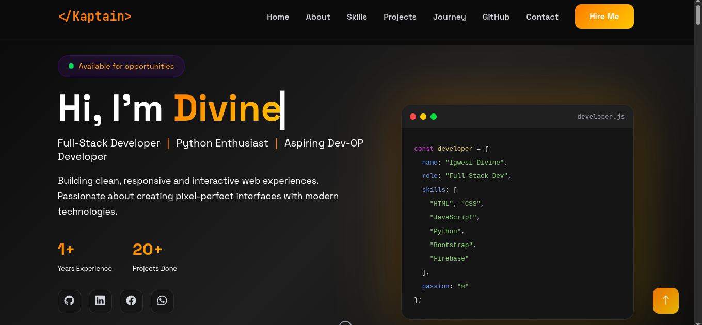
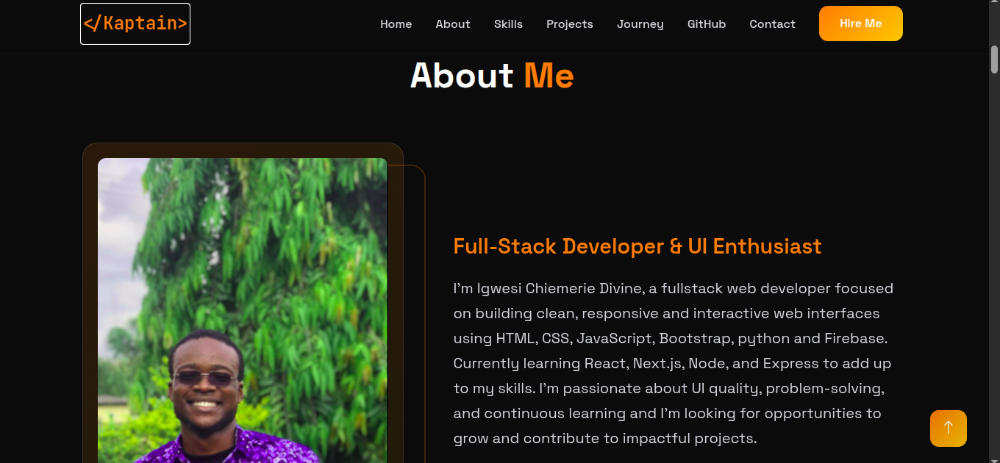
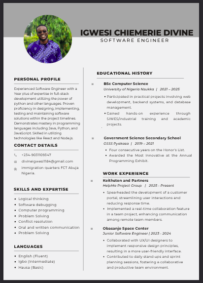
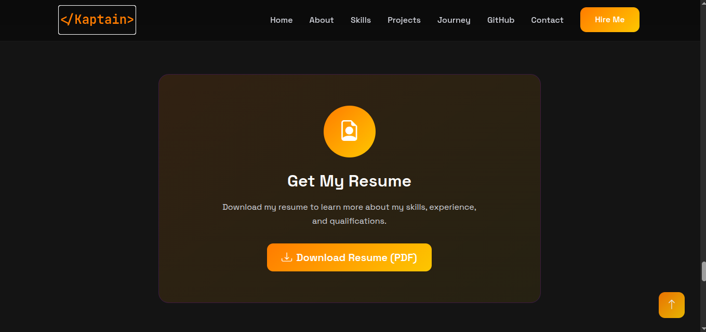
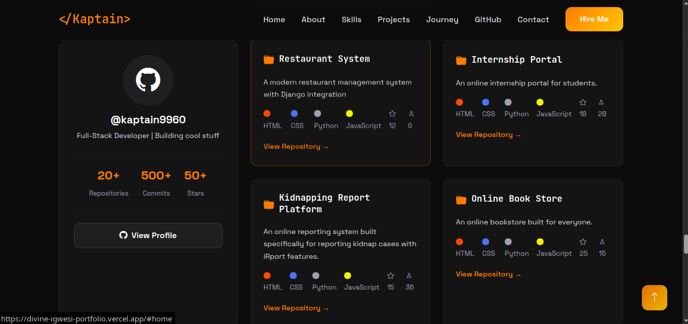
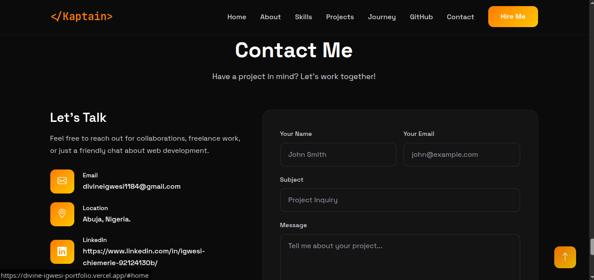

Personal Portfolio – Kaptain Divine

Welcome to my Personal Portfolio, an interactive showcase of my skills, projects, and accomplishments as a front-end web developer. This portfolio serves as a professional platform to present my experience in HTML, CSS, JavaScript, and React, as well as my ability to design responsive, user-friendly, and visually appealing websites. It reflects my passion for web development, attention to detail, and commitment to creating high-quality digital experiences.

Table of Contents

About the Project

Features

Technologies Used

Project Structure

Installation & Setup

Usage

Future Improvements

Contact

About the Project

This portfolio is a professional representation of my web development journey. It is designed to provide visitors with an overview of my skills, completed projects, and professional achievements. Every section of the site, from the project showcase to the contact form, has been thoughtfully crafted to ensure a smooth and engaging user experience.

Key objectives of this project include:

Demonstrating clean, semantic HTML and organized CSS styling.

Highlighting proficiency in JavaScript for interactive functionality.

Showcasing experience with React for building dynamic and modular components.

Creating a responsive design that adapts to multiple devices and screen sizes.

Features

Clean and Modern Design – A visually appealing layout with organized sections and smooth navigation.

Fully Responsive – Optimized for desktop, tablet, and mobile devices.

Project Showcase – Displays a portfolio of my web development projects with live links and descriptions.

Downloadable CV / Resume – Visitors can download my CV directly from the portfolio.

Interactive Elements – Includes smooth scrolling, hover effects, buttons, and clickable sections.

Contact Form – Allows potential employers, collaborators, or clients to get in touch directly.

Accessible Design – Ensures readability, accessibility, and a pleasant user experience across devices.

Technologies Used

Frontend Development:

HTML5 for structure and content

CSS3 (Flexbox, Grid, Media Queries) for styling and responsive layouts

JavaScript for interactivity

Tools & Platforms:

VSCode as the code editor

Git & GitHub for version control and project hosting

Browser DevTools for debugging and optimization

Project Structure
personal-portfolio/
│
├─ assets/                # Images, CV, icons, and media files
├─ index.html             # Main landing page
├─ style.css              # Global CSS styles
├─ script.js              # JavaScript for interactive features
 ─ README.md              # Project documentation

This structure ensures that all files are organized logically for easy maintenance and scalability.

Installation & Setup

Follow these steps to run the project locally:

Clone the repository:

git clone https://github.com/kaptain9960/main-portfolio.git

Navigate to the project folder:

cd main-portfolio

Open the project:

For a plain HTML/CSS/JS version: Open index.html in your browser.

For React projects: Run a local server using:

npm install
npm start

Usage

Explore my portfolio to view completed projects, skills, and achievements.

Download my CV directly from the portfolio to learn more about my professional background.

Use the contact section to reach out for collaborations, internships, or job opportunities.

All interactive elements, hover effects, and smooth scrolling demonstrate my front-end development skills.

Future Improvements

Dark Mode Toggle – Allow users to switch between light and dark themes for accessibility and user preference.

Dedicated Profile Page – Highlight professional experience, certifications, and personal achievements.

Comment Section / Feedback – Enable visitors to leave feedback or testimonials for projects.

Additional Project Showcase – Include more projects, case studies, and live demos.

Enhanced Animations & Interactivity – Add subtle animations for a more engaging user experience.

Contact

I am always open to collaborations, feedback, or career opportunities. You can reach me through:

GitHub: https://github.com/kaptain9960

Email: divineigwesi1184@gmail.com

Feel free to explore my portfolio and contact me for gigs 
